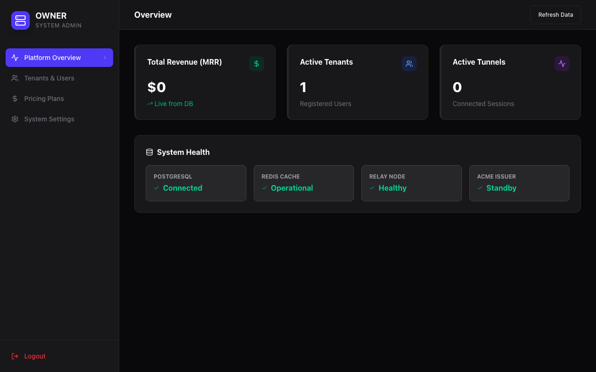
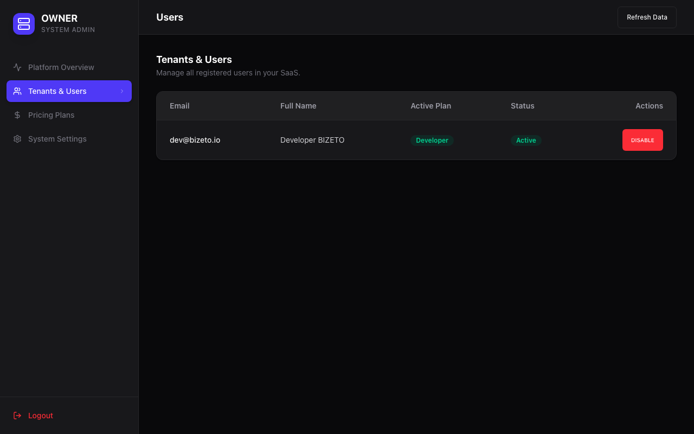
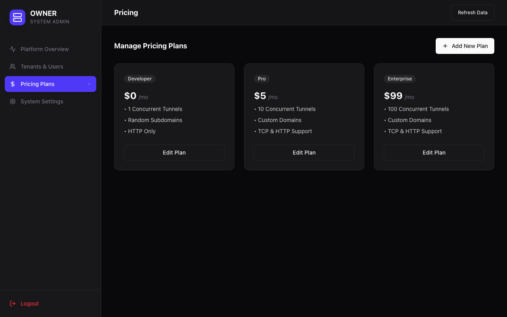
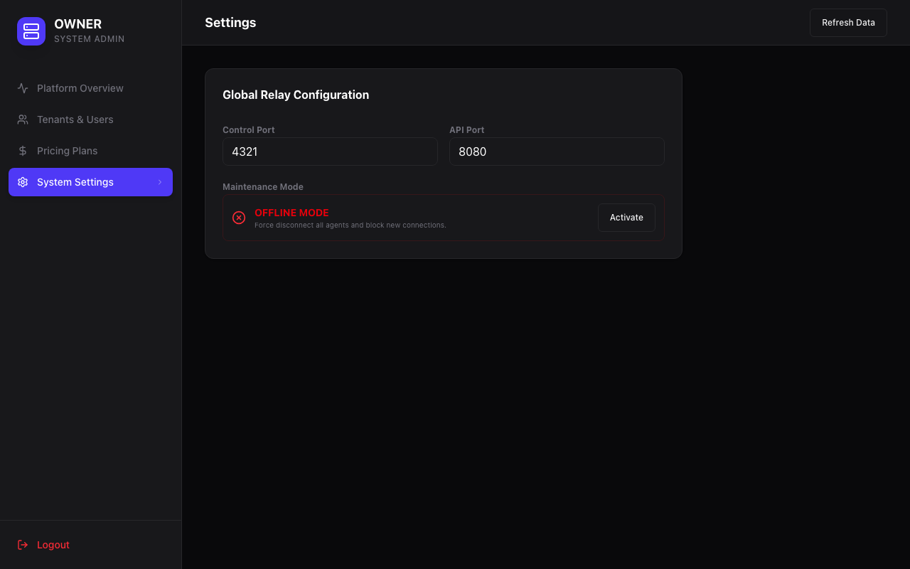

# 📕 Panduan Admin (Owner Dashboard)

Panduan ini ditujukan bagi administrator sistem untuk mengelola infrastruktur dan bisnis SaaS BIZETO-Tunnel.

## 1. Platform Overview (Kesehatan Sistem)
Monitor kesehatan seluruh cluster relay dan pendapatan (MRR) dalam satu layar.

*   **Total Revenue:** Akumulasi pendapatan dari seluruh subscription aktif.
*   **System Health:** Status koneksi ke PostgreSQL, Redis, dan Relay Node.

## 2. Manajemen Tenant & User
Kontrol penuh terhadap akses pengguna ke dalam platform.

*   **Daftar User:** Pantau siapa saja yang menggunakan layanan.
*   **Toggle Status:** Aktifkan atau nonaktifkan akses pengguna secara instan jika terdeteksi penyalahgunaan.

## 3. Paket Harga (Pricing Plans)
Atur model bisnis Anda dengan menambah atau mengedit paket langganan.

*   **Limit Fitur:** Tentukan batas maksimal tunnel, dukungan custom domain, dan protokol TCP untuk setiap paket.

## 4. Konfigurasi Sistem
Pengaturan global untuk parameter teknis Relay Server.

*   **Maintenance Mode:** Aktifkan mode pemeliharaan untuk mengunci sistem secara keseluruhan.
*   **Port Mapping:** Lihat pemetaan port aktif untuk Control Plane dan API.
