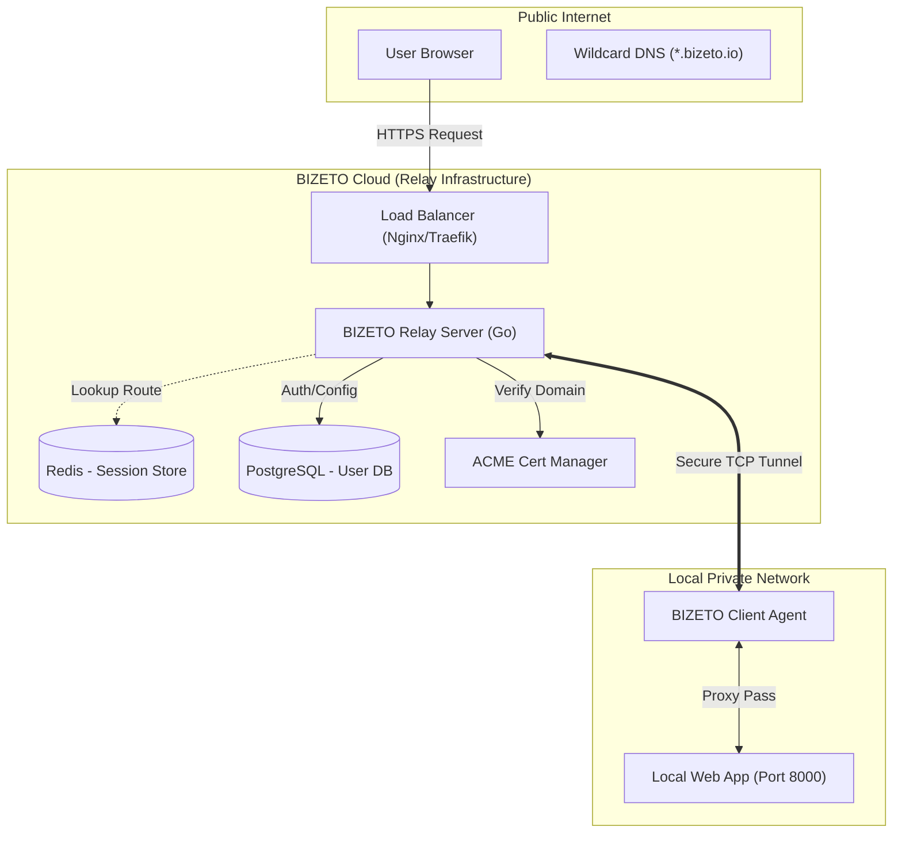
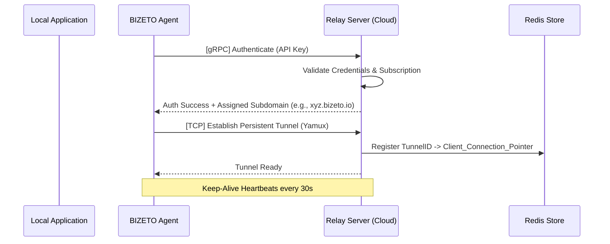

# Technical Architecture Document: BIZETO-Tunnel

**Version:** 1.0.0  
**Role:** Lead Software Architect  
**Status:** Design Phase (Finalized)

---

## 1. Executive Summary
BIZETO-Tunnel is a high-performance, secure reverse proxy tunneling solution designed to expose local services to the public internet via a centralized relay server. The system prioritizes low-latency data transfer, automatic SSL/TLS termination, and support for custom branding via Custom Domains. It serves as a foundational infrastructure for developers and businesses needing to bypass NAT/Firewalls without complex networking configurations.

## 2. Architectural Goals
*   **Low Latency:** Minimize the overhead of data encapsulation and relaying.
*   **Scalability:** Support thousands of concurrent tunnels using stateless relay nodes.
*   **Security:** Ensure end-to-end encryption and robust authentication for client agents.
*   **Resilience:** Implement automatic reconnection logic and heartbeat monitoring.
*   **User Experience:** Seamless integration with custom domains (e.g., `app.yourdomain.com`).

## 3. High-Level Tech Stack

| Layer | Technology | Rationale |
| :--- | :--- | :--- |
| **Core Language** | Go (Golang) | Superior concurrency model (Goroutines) and mature standard networking library. |
| **Tunneling Protocol** | Yamux / TCP Multiplexing | Allows multiple logical streams over a single persistent TCP connection. |
| **Control Plane** | gRPC / Protocol Buffers | Efficient, strongly-typed bi-directional streaming for management commands. |
| **Data Plane** | Raw TCP / TLS | Direct byte-copying for maximum throughput and minimal overhead. |
| **Cache & Session** | Redis | Real-time mapping of Host Header to Active Tunnel ID. |
| **Persistence** | PostgreSQL | Storage for user credentials, API keys, and custom domain configurations. |
| **SSL/TLS** | Let's Encrypt (ACME) | Automated certificate issuance and renewal for custom domains. |

## 4. System Architecture (UML Component Diagram)

## 5. Detailed Logic & Sequence Diagrams

### 5.1 Tunnel Establishment
The following sequence describes how the local agent establishes a persistent connection to the cloud relay.

### 5.2 Data Flow (Request/Response)
How an external user request reaches the local application:

1.  **Ingress:** A user hits `https://xyz.bizeto.io`.
2.  **Route Discovery:** The Relay Server parses the Host header. It queries Redis to find which active Tunnel ID is associated with `xyz.bizeto.io`.
3.  **Encapsulation:** The HTTP request is wrapped into a Yamux stream frame.
4.  **Relay:** The frame is sent through the existing persistent TCP tunnel to the Agent.
5.  **Demux:** The Agent receives the frame, opens a local connection to `localhost:8000`, and writes the data.
6.  **Response:** The response travels back through the same multiplexed stream.

## 6. The "Custom Domain" Implementation
To support `namadomain.com` instead of a subdomain:

*   **DNS Configuration:** User creates a CNAME or A Record pointing to the BIZETO Relay IP.
*   **Host Header Mapping:** The Relay Server is configured to recognize `namadomain.com` in the HTTP header.
*   **Dynamic SSL:** The Cert Manager component detects the new domain, initiates an ACME challenge (HTTP-01), and installs the certificate in memory for that specific tunnel session.

## 7. Case Study: Enterprise Webhook Integration

### Skenario: BIZETO WhatsApp ERPNext Integration
A business (Kusuma Sembako) runs their ERPNext instance on a local server in a warehouse without a static public IP. They need to receive real-time webhooks from a WhatsApp Business API provider.

**The Problem:**
WhatsApp API requires a valid HTTPS URL (SSL) to send incoming message notifications (Webhooks).

**The BIZETO-Tunnel Solution:**
*   **Deployment:** The admin runs the BIZETO Agent on the ERPNext server.
*   **Configuration:** `bizeto-tunnel http 80 --domain webhook.kusumasembako.com`.
*   **Automated SSL:** BIZETO Relay automatically provisions an SSL certificate for `webhook.kusumasembako.com`.
*   **Live Integration:** The business enters this URL into the WhatsApp API dashboard.

**Result:**
When a customer sends a WhatsApp message, the webhook hits the cloud relay, tunnels through to the warehouse server, and triggers the ERPNext logic instantly. Data remains secure and private within the local network.

## 8. Resilience & Fault Tolerance
*   **Graceful Reconnection:** If the tunnel drops, the Agent uses an exponential backoff strategy to reconnect.
*   **Circuit Breaker:** If the local application is down (returning 502/504), the Agent notifies the Relay to display a custom "Local Server Offline" page to the end-user.
*   **Health Checks:** The Relay Server monitors the RTT (Round Trip Time) of the tunnel to ensure performance standards are met.
