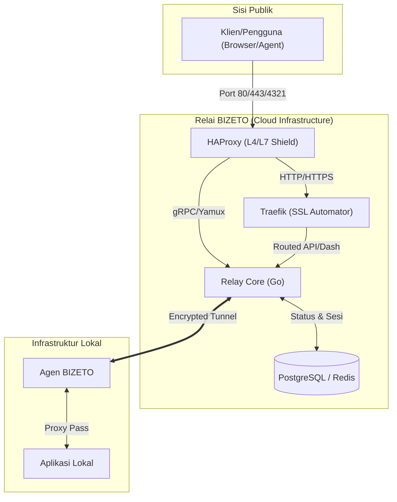

# Dokumen Arsitektur Teknis: BIZETO-Tunnel

**Versi:** 1.1.0  
**Peran:** Lead Software Architect  
**Status:** Fase Desain (Diperbarui dengan Visi Komunitas & Enterprise)

---

## 1. Ringkasan Eksekutif & Visi
BIZETO-Tunnel adalah solusi *tunneling* berperforma tinggi yang menjembatani kesenjangan antara kemudahan layanan komersial (seperti ngrok) dan privasi model *self-hosted* (seperti frp). 

**Visi Utama:** Menyediakan infrastruktur kelas dunia yang dapat diakses oleh siapa saja dengan biaya minimal (berbasis donasi), fokus pada identitas merek (*branding*), dan keamanan tanpa kompromi.

## 2. Pilar Strategis (The BIZETO Way)
*   **Performa Enterprise, Biaya Komunitas:** Mengoptimalkan penggunaan sumber daya sehingga biaya operasional rendah, memungkinkan model gratis/donasi bagi pengguna individu namun tetap tangguh untuk beban kerja perusahaan.
*   **Model Hybrid (Self-Hosted & Managed):** Pengguna dapat menggunakan server relai BIZETO (Managed) untuk kemudahan, atau menjalankan infrastruktur relai sendiri (Self-hosted) dengan kode sumber yang sama.
*   **Fokus Branding Utama:** Kustom domain bukan fitur mewah, melainkan fitur standar. Setiap *tunnel* dirancang untuk memperkuat identitas merek pengguna.
*   **Keamanan "Zero-Trust Ready":** Integrasi enkripsi TLS otomatis di setiap titik dan dukungan autentikasi berlapis.

## 3. Tujuan Arsitektur
*   **Latensi Ultra-Rendah:** Menggunakan *zero-copy data transfer* di level TCP untuk kecepatan maksimal.
*   **Protokol Luas:** Dukungan penuh untuk HTTPS (Web) dan Raw TCP (Database, SSH, IoT).
*   **Otomasi Sertifikat:** Manajemen SSL/TLS (Let's Encrypt) yang sepenuhnya otomatis dan transparan bagi pengguna.
*   **Resiliensi Tinggi:** Deteksi kegagalan instan dan penyambungan ulang otomatis dengan *exponential backoff*.

## 4. Stack Teknologi (Dioptimalkan untuk Efisiensi)

| Lapisan | Teknologi | Rasional |
| :--- | :--- | :--- |
| **Bahasa Utama** | Go (Golang) | Efisiensi memori tinggi, biner tunggal yang mudah dideploy (cocok untuk self-hosted). |
| **Multiplexing** | Yamux | Stabil, ringan, dan memungkinkan ribuan aliran dalam satu koneksi TCP. |
| **L4 Shield (TCP)** | HAProxy | Performa tinggi untuk proteksi DDoS, rate limiting, dan manajemen koneksi TCP murni. |
| **L7 Automator (SSL)** | Traefik | Manajemen SSL/TLS (ACME) otomatis dan routing dinamis berbasis label Docker. |
| **Data Store** | Redis (Ephemeral) | Kecepatan akses milidetik untuk pemetaan rute *tunnel* yang sedang aktif. |
| **Distribusi** | Docker / Binary | Memudahkan pengguna *self-hosted* menjalankan relai mereka sendiri dalam hitungan detik. |

## 5. Arsitektur Sistem (Enterprise Grade - Dual Proxy)

### 5.1 Mekanisme Perisai Ganda
1.  **HAProxy (Lapis 1):** Bertindak sebagai filter pertama. Menangani *rate limiting* koneksi TCP mentah untuk mencegah serangan DDoS dan *brute force* pada protokol Yamux dan gRPC.
2.  **Traefik (Lapis 2):** Fokus pada protokol HTTP/HTTPS. Mengelola sertifikat SSL (Let's Encrypt) secara otomatis dan melakukan routing cerdas ke Dashboard atau API Relay.
3.  **Relay Core:** Fokus sepenuhnya pada logika bisnis *tunneling* dan manajemen sesi tanpa terbebani tugas enkripsi SSL manual atau proteksi banjir koneksi.

## 6. Implementasi Branding & Domain
BIZETO menempatkan *branding* di pusat sistem:
1.  **CNAME Mapping:** Pengguna cukup mengarahkan CNAME ke `relay.bizeto.io`.
2.  **Wildcard SSL:** Mendukung subdomain tak terbatas dengan satu sertifikat.
3.  **Dedicated SSL:** Setiap domain kustom mendapatkan sertifikat SSL unik yang diperbarui otomatis.
4.  **White-label Ready:** Logika sistem yang memungkinkan agensi menyediakan layanan *tunneling* dengan merek mereka sendiri.

## 7. Model Operasional & Biaya
*   **Versi Komunitas (Free/Donasi):** Akses penuh ke fitur inti dengan dukungan komunitas.
*   **Self-Hosted (Free):** Jalankan di server sendiri tanpa biaya lisensi.
*   **Enterprise Managed (Murah):** Biaya minimal hanya untuk menutupi biaya infrastruktur awan, bertujuan mendukung ekosistem tanpa membebani UMKM.

## 8. Skenario Keamanan Tinggi
*   **End-to-End Encryption:** Data dienkripsi dari browser pengguna hingga ke aplikasi lokal.
*   **IP Whitelisting:** Membatasi akses *tunnel* hanya dari IP tertentu.
*   **Authentication Middleware:** Menambahkan lapisan login (Basic Auth atau OAuth) di depan aplikasi lokal tanpa mengubah kode aplikasi tersebut.

## 9. Perbandingan Kompetitif & Analisis Spesifikasi

| Fitur | Ngrok | Cloudflare Tunnel | Localtunnel | frp (Self-Hosted) | BIZETO-Tunnel (Target) |
| :--- | :--- | :--- | :--- | :--- | :--- |
| **Model Bisnis** | Freemium (Mahal) | Gratis (SaaS) | Open Source | Self-Hosted | Hybrid (Donasi/Free) |
| **Kemudahan** | Sangat Mudah | Menengah | Sangat Mudah | Sulit (Manual) | Mudah (Zero Config) |
| **Keamanan** | Standar | Sangat Tinggi | Rendah | Tergantung User | Tinggi (SSL + Auth) |
| **Kustom Domain** | Bayar Tinggi | Gratis (di CF) | Terbatas | Bebas | Fokus Utama (Gratis) |
| **Kebutuhan Server** | Managed (SaaS) | Managed (SaaS) | Managed (Shared) | VPS (User Provide) | VPS Ringan (1 vCPU) |
| **Efisiensi RAM** | N/A (Cloud) | N/A (Cloud) | Rendah | Menengah (Go) | Sangat Tinggi (Go-Opt) |

## 10. Kesimpulan & Rekomendasi Spesifikasi

Berdasarkan analisis performa dan efisiensi biaya untuk menjalankan BIZETO-Tunnel secara mandiri (*self-hosted*) atau sebagai relai komunitas, berikut adalah rekomendasi spesifikasi server yang paling optimal:

### Rekomendasi Utama: "The Lean Relay" (VPS Murah)
Spesifikasi ini sangat disarankan untuk penggunaan harian, pengembangan, dan UMKM karena keseimbangan antara performa dan biaya.
*   **CPU:** 1 Core (Shared OK)
*   **RAM:** 1 GB (DDR4/DDR5)
*   **Storage:** 10-20 GB SSD/NVMe
*   **Bandwidth:** Minimum 100 Mbps dengan kuota >500 GB.
*   **Penyedia:** Oracle Cloud Free Tier (A1 instance) atau VPS seharga ~$4-$5/bulan (Hetzner, Vultr, DigitalOcean).

**Mengapa Spesifikasi Ini?**
BIZETO-Tunnel dibangun menggunakan Go yang memiliki *garbage collection* sangat efisien dan penggunaan memori yang statis. Untuk melayani hingga 100 koneksi bersamaan, penggunaan RAM biasanya tidak akan melebihi 300MB, sehingga 1GB RAM memberikan *headroom* yang sangat aman untuk OS dan Redis.
