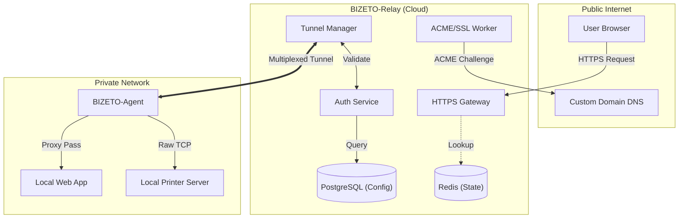
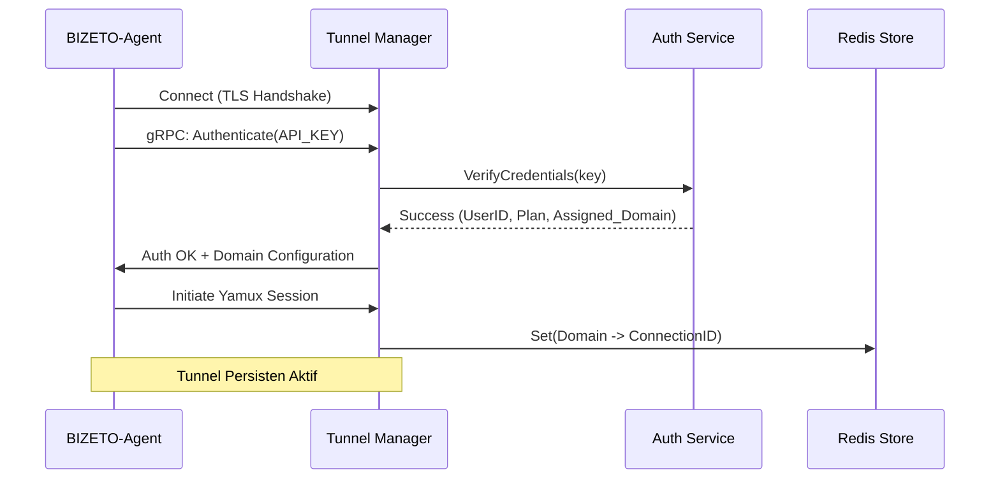
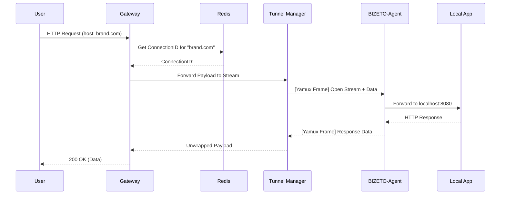
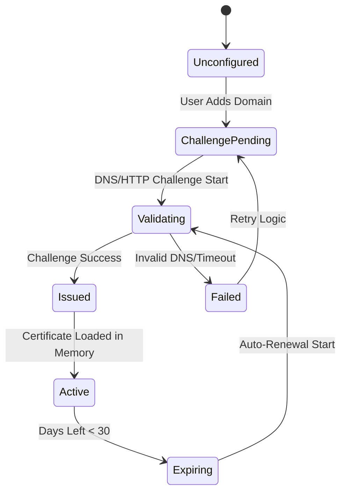
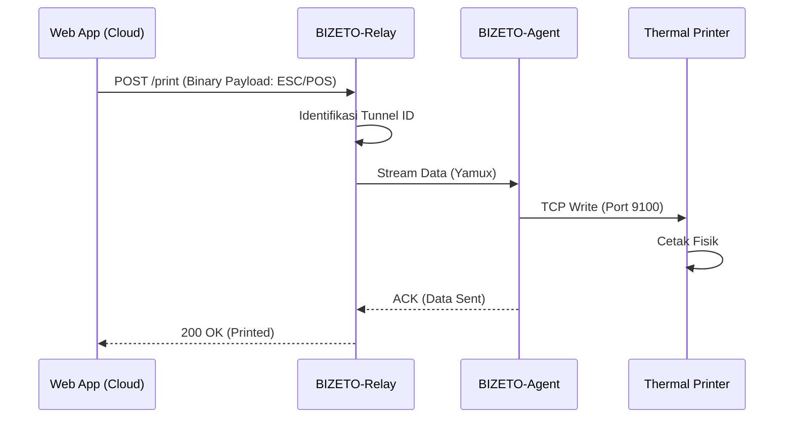

# Dokumentasi Teknis Komprehensif: BIZETO-Tunnel

**Versi:** 1.2.0  
**Status:** Dokumen Teknis Final  
**Teknologi Utama:** Go, Yamux, gRPC, Redis, PostgreSQL

---

## 1. Arsitektur Global (Sistem Terdistribusi)

BIZETO-Tunnel terdiri dari dua komponen utama: **BIZETO-Relay** (di Cloud) dan **BIZETO-Agent** (di Jaringan Privat). Keduanya berkomunikasi melalui koneksi TCP tunggal yang di-multiplexing.

### 1.1 Diagram Komponen (UML Component Diagram)

---

## 2. Alur Pembentukan Tunnel (Control Plane)

Control Plane bertanggung jawab atas autentikasi dan negosiasi parameter tunnel sebelum data dialirkan.

### 2.1 Diagram Sekuensial: Autentikasi & Handshake

---

## 3. Multiplexing Data (Data Plane)

BIZETO menggunakan protokol **Yamux** untuk memungkinkan ratusan permintaan HTTP/TCP berjalan secara paralel di atas satu koneksi fisik yang sama.

### 3.1 Diagram Alir Data: Request Handling

---

## 4. Lifecycle Manajemen SSL (ACME)

Untuk setiap domain kustom, BIZETO secara otomatis mengelola siklus hidup sertifikat SSL.

### 4.1 State Diagram: Sertifikat SSL

---

## 5. Studi Kasus Teknis: Remote Printing

Dalam kasus printer, BIZETO-Tunnel tidak melakukan interpretasi protokol (Layer 7), melainkan hanya meneruskan aliran byte mentah (Layer 4).

### 5.1 Alur UML: Cloud-to-Printer

---

## 6. Spesifikasi Teknis Komponen

### 6.1 BIZETO-Relay (Go)
*   **Networking:** `net.Listen`, `crypto/tls` (TLS 1.3).
*   **Multiplexing:** `hashicorp/yamux`.
*   **Caching:** `go-redis`.
*   **Service Mesh:** gRPC untuk komunikasi internal.

### 6.2 BIZETO-Agent (Go)
*   **Binary Size:** ~15MB (Statis, tanpa dependensi eksternal).
*   **Platform:** Mendukung `GOOS=linux, windows, darwin` dan `GOARCH=amd64, arm64, arm`.
*   **Reverse Proxy:** Menggunakan `httputil.ReverseProxy` untuk HTTP dan `io.Copy` untuk Raw TCP.

---

## 7. Ketahanan (Fault Tolerance)

1.  **Exponential Backoff:** Jika koneksi ke Relay terputus, Agent akan mencoba menyambung kembali dengan jeda waktu yang meningkat (1s, 2s, 4s, ..., max 30s).
2.  **Heartbeat/Keep-Alive:** Ping setiap 30 detik untuk memastikan koneksi TCP tidak diputus oleh firewall perantara atau beban penyeimbang (Load Balancer).
3.  **Graceful Shutdown:** Menutup semua aliran aktif sebelum biner dihentikan.
