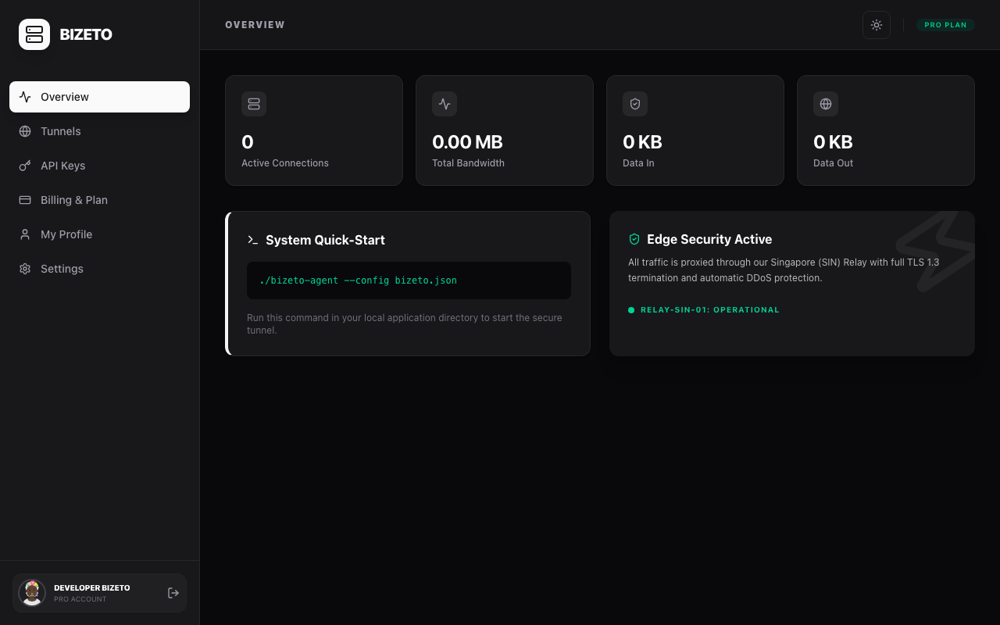
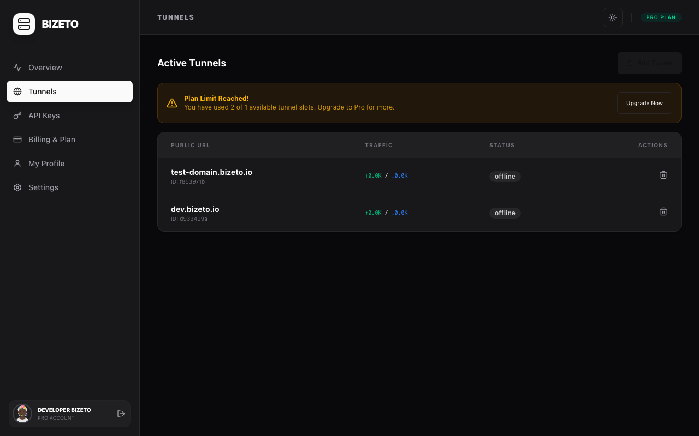
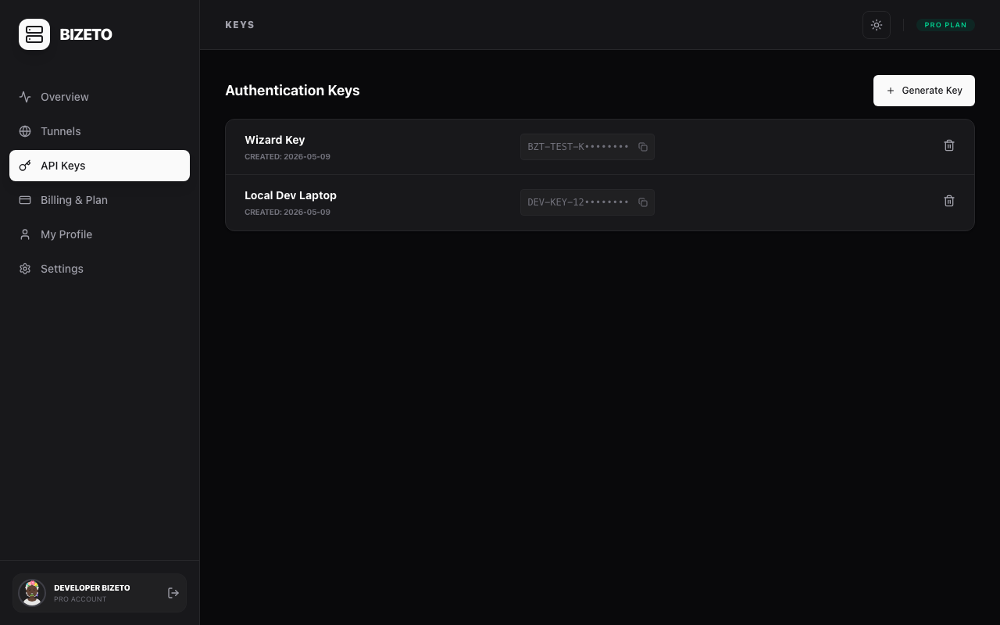
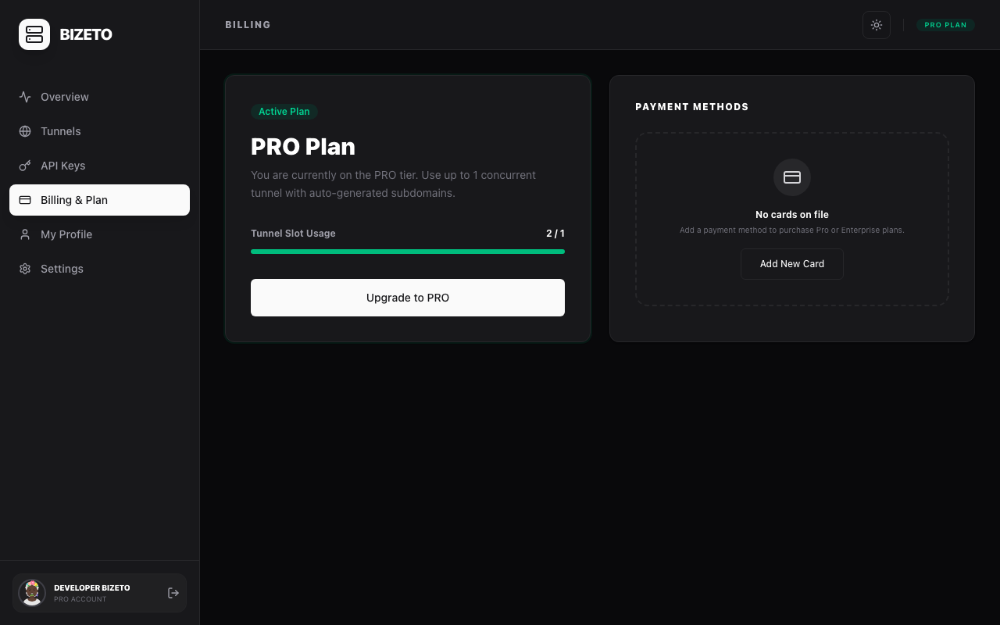
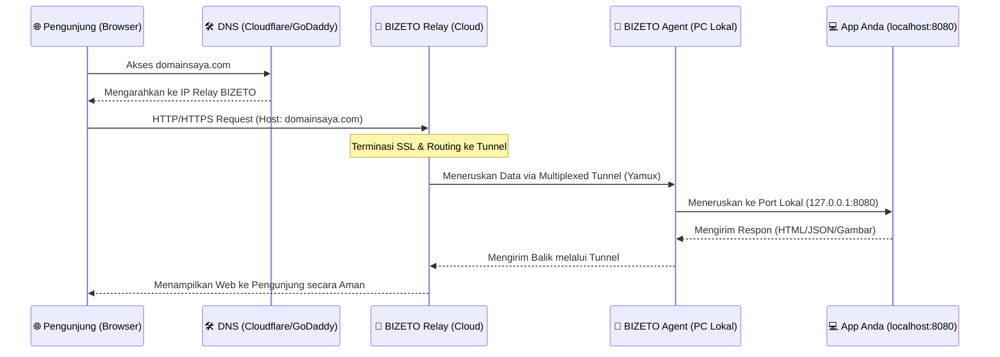

# 📘 Panduan Pengguna BIZETO-Tunnel

Selamat datang di BIZETO-Tunnel, solusi tunneling aman untuk mengekspos aplikasi lokal Anda ke internet.

## 1. Memulai (Onboarding)
Saat pertama kali login, Anda akan dipandu melalui 4 langkah dasar:
1.  **Unduh Agent:** Pilih biner yang sesuai dengan sistem operasi Anda.
2.  **API Key:** Dapatkan identitas unik perangkat Anda.
3.  **Daftarkan Tunnel:** Tentukan port lokal yang ingin di-tunnel.
4.  **Jalankan:** Jalankan perintah terminal untuk mengaktifkan koneksi.

## 2. Ringkasan Statistik (Overview)
Halaman ini memberikan gambaran real-time tentang penggunaan bandwidth dan koneksi aktif Anda.



*   **Active Connections:** Jumlah perangkat yang terhubung saat ini.
*   **Data In/Out:** Volume data yang ditransfer melalui tunnel Anda.

## 3. Manajemen Tunnel (Tunnels)
Tempat utama untuk mengelola alamat publik Anda.


### Menambah Tunnel Baru
Klik tombol **"+ Add Tunnel"** untuk membuka wizard pendaftaran. Masukkan port lokal Anda dan sistem akan mereservasi domain secara instan.



## 4. Keamanan & API Keys
Kelola kunci akses untuk agent Anda di sini. Ingat, satu kunci sebaiknya digunakan untuk satu perangkat.



## 5. Billing & Subscription
Lihat paket aktif Anda dan sisa kuota tunnel yang tersedia.



---

## 6. Panduan Instalasi & Penggunaan Agent

`bizeto-agent` adalah aplikasi portabel yang tidak memerlukan proses instalasi rumit. Ikuti langkah-langkah di bawah ini untuk memulai:

### 📥 Langkah 1: Unduh Biner Agent
Pilih biner yang sesuai dengan sistem operasi Anda dari menu **Onboarding** atau **Downloads** di Dashboard:
*   **Linux:** `bizeto-agent-linux-amd64`
*   **macOS (M1/M2/M3):** `bizeto-agent-darwin-arm64`
*   **macOS (Intel):** `bizeto-agent-darwin-amd64`
*   **Windows:** `bizeto-agent-windows-amd64.exe`

### ⚙️ Langkah 2: Berikan Izin Eksekusi (Linux & macOS)
Khusus pengguna Linux dan macOS, Anda harus memberikan izin agar file biner dapat dijalankan:
1.  Buka Terminal.
2.  Masuk ke folder tempat Anda menyimpan file tersebut.
3.  Jalankan perintah:
    ```bash
    chmod +x bizeto-agent-darwin-arm64  # Sesuaikan dengan nama file Anda
    ```

### 📄 Langkah 3: Siapkan Konfigurasi (`bizeto.json`)
Agent memerlukan file `bizeto.json` yang berisi identitas dan target port Anda.
1.  Unduh file ini dari Wizard **Add Tunnel**.
2.  Letakkan file `bizeto.json` di dalam folder yang sama dengan biner `bizeto-agent`.

### 🚀 Langkah 4: Menjalankan Agent
Buka Terminal atau PowerShell, lalu jalankan perintah berikut:

#### **Linux / macOS:**
```bash
./bizeto-agent --config bizeto.json
```

#### **Windows (PowerShell):**
```powershell
.\bizeto-agent-windows-amd64.exe --config bizeto.json
```

---

### ✅ Verifikasi Koneksi
Jika berhasil, terminal akan menampilkan pesan:
`Authenticated! Your domain: https://user-app.bizeto.io`

---

## 7. Diagram Alur Teknis (Custom Domain)

Berikut adalah gambaran bagaimana trafik dari internet mencapai aplikasi lokal Anda melalui infrastruktur BIZETO-Tunnel:



### 🗝️ Poin Kunci Keamanan:
*   **Encrypted:** Seluruh trafik antara Pengunjung dan Relay dienkripsi dengan TLS 1.3.
*   **Private:** Agent Anda hanya melakukan koneksi *Outbound* ke Relay. Anda tidak perlu membuka port di router atau mengubah pengaturan firewall rumah/kantor.
*   **Masked:** Alamat IP asli PC lokal Anda tidak pernah bocor ke publik.
